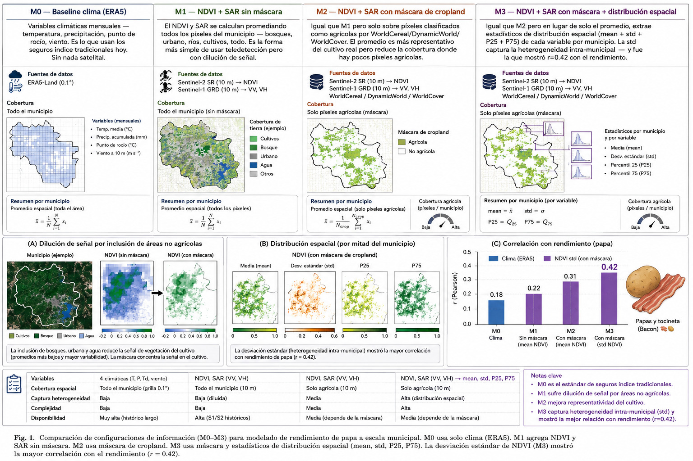

# Adquisición y Preprocesamiento de Datos
## Seguro Índice Basado en Teledetección Espaciotemporal para Frijol en el Valle del Cauca

---

## 1. Área de estudio y variable objetivo

El estudio se focaliza en el cultivo de **frijol** (*Phaseolus vulgaris*) en los **40 municipios del Valle del Cauca**, Colombia, cubriendo el período **2006–2024**. El frijol es un cultivo transitorio de ciclo corto (~90 días), con dos cosechas anuales (semestres A y B), y alta sensibilidad a variaciones climáticas e hídricas, lo que lo convierte en un candidato natural para el diseño de seguros índice basados en teledetección.

### 1.1 Variable objetivo (Y)

La variable objetivo es el **rendimiento anual de frijol** (toneladas por hectárea, t/ha), obtenido de las **Evaluaciones Agropecuarias Municipales (EVA)** del Ministerio de Agricultura y Desarrollo Rural de Colombia (MADR), disponibles a través del portal de datos abiertos `datos.gov.co`.

Se integraron dos datasets complementarios:

| Dataset | ID Socrata | Cobertura temporal | URL |
|---|---|---|---|
| EVA Histórico | `2pnw-mmge` | 2006–2018 | datos.gov.co |
| EVA 2019-2024 | `uejq-wxrr` | 2019–2024 | datos.gov.co |

Los datasets presentan diferencias en nomenclatura de columnas: el histórico reporta `rendimiento_t_ha` mientras que el más reciente usa `rendimiento`. Adicionalmente, los nombres de municipios difieren en el uso de tildes y nombres oficiales completos (e.g., `SANTIAGO DE CALI` vs `CALI`, `GUADALAJARA DE BUGA` vs `BUGA`). Se aplicó normalización mediante eliminación de diacríticos, mayusculización y un mapa de alias explícito.

Dado que el EVA reporta datos semestrales (períodos A y B), se promedió el rendimiento por municipio y año para obtener una observación anual por municipio.

#### Estadísticas del panel final

| Estadístico | Valor |
|---|---|
| Observaciones totales | 697 |
| Municipios | 40 |
| Años | 2006–2024 (19 años) |
| Completitud del panel | 91.7% (63 celdas faltantes) |
| Rendimiento medio (antes de winsorización) | 1.187 t/ha |
| Rendimiento std (antes) | 0.717 t/ha |
| Rendimiento máximo (antes) | 12.59 t/ha |

Se identificaron **5 observaciones atípicas extremas** (rendimiento > 3.34 t/ha, equivalente a media + 3σ), siendo el caso más extremo El Cerrito 2023 con 12.59 t/ha — 16 desviaciones estándar sobre la media. Estas observaciones corresponden probablemente a errores de reporte o cambios en metodología de encuesta. Se aplicó **winsorización** al percentil definido por media + 3σ = 3.34 t/ha, preservando el número de observaciones.

| Estadístico | Valor (post-winsorización) |
|---|---|
| Rendimiento medio | 1.165 t/ha |
| Rendimiento std | 0.533 t/ha |
| Rendimiento máximo | 3.338 t/ha |

---

## 2. Variables de entrada (X) — Features satelitales

Se diseñaron **cuatro configuraciones de features** satelitales para permitir una comparación sistemática del efecto de la estrategia de agregación espacial sobre la calidad del índice de seguro. La Figura 1 resume visualmente las diferencias entre configuraciones.



**Figura 1.** Comparación de configuraciones de información (M0–M3) para modelado de rendimiento de frijol a escala municipal. M0 usa solo clima (ERA5). M1 agrega NDVI y SAR sin máscara. M2 usa máscara de cropland. M3 usa máscara y estadísticos de distribución espacial (mean, std, P25, P75). La desviación estándar de SAR VV (M3) mostró la mayor correlación con el rendimiento (r = 0.42).

---

| Config | Descripción | Fuentes | Features | Cobertura |
|---|---|---|---|---|
| **M0** | Variables climáticas ERA5 — baseline industria | ERA5-Land | 48 | 100% |
| **M1** | NDVI + SAR sin máscara de cultivos | MODIS + PALSAR + S1 | 50 | 71.9% |
| **M2** | NDVI + SAR con máscara de cropland | MODIS + PALSAR + S1 + WorldCereal | 50 | 71.9% |
| **M3** | NDVI + SAR con máscara + distribución espacial | MODIS + PALSAR + S1 + WorldCereal | 200 | 35.7% |

Todas las features fueron extraídas a nivel de municipio usando **Google Earth Engine (GEE)**, con el polígono administrativo de cada municipio como unidad de agregación (capa FAO/GAUL 2015 level 2, filtrada para el Valle del Cauca).

### 2.1 Configuración M0 — Baseline climático (ERA5-Land)

M0 replica la práctica actual de los seguros índice agrícolas en Colombia, que utilizan variables climáticas como proxy del estado del cultivo. Las variables provienen del reanálisis climático **ERA5-Land** (ECMWF), disponible en GEE como `ECMWF/ERA5_LAND/MONTHLY_AGGR`, con resolución espacial de ~9 km y cobertura desde 1950 hasta el presente.

Se extrajeron **4 variables × 12 meses = 48 features**:

| Variable | Unidad original | Transformación |
|---|---|---|
| Temperatura media a 2m (`temperature_2m`) | K | − 273.15 → °C |
| Precipitación total (`total_precipitation_sum`) | m | × 1000 → mm |
| Temperatura punto de rocío (`dewpoint_temperature_2m`) | K | − 273.15 → °C |
| Velocidad del viento a 10m | m/s | √(u² + v²) |

### 2.2 Configuración M1 — NDVI + SAR sin máscara

M1 incorpora índices de vegetación ópticos y backscatter SAR, agregados como promedio sobre el área total del municipio sin discriminar por tipo de uso del suelo.

#### MODIS MOD13Q1 (índices de vegetación)

- **Asset GEE**: `MODIS/061/MOD13Q1`
- **Resolución**: 250 m, composites de 16 días
- **Cobertura**: 2000–presente (se usó 2006–2024)
- **Variables**: NDVI, EVI (escala aplicada: × 0.0001)
- **Agregación**: promedio mensual por municipio → 2 variables × 12 meses = **24 features**

#### ALOS PALSAR / PALSAR-2 (SAR anual, banda L)

- **Assets GEE**: `JAXA/ALOS/PALSAR/YEARLY/SAR` (2007–2010) y `JAXA/ALOS/PALSAR/YEARLY/SAR_EPOCH` (2015–2024)
- **Resolución**: 25 m, mosaico anual
- **Banda**: L-band (23 cm de longitud de onda) — penetra dosel vegetal
- **Variables**: HH, HV (convertidas de DN a dB: `10·log₁₀(DN²) − 83`)
- **Gap**: 2011–2014 sin datos entre sensores
- **Agregación**: promedio anual por municipio → **2 features**

#### Sentinel-1 GRD (SAR mensual, banda C)

- **Asset GEE**: `COPERNICUS/S1_GRD`
- **Resolución**: 10 m, revisita ~12 días
- **Disponibilidad**: desde abril 2014 (cobertura parcial 2014–2016)
- **Banda**: C-band (5.6 cm) — más sensible a superficie y estructura superior del dosel
- **Variables**: VV, VH (dB, modo IW)
- **Agregación**: mediana mensual por municipio → 2 variables × 12 meses = **24 features**

> **Nota sobre compatibilidad PALSAR–Sentinel-1**: PALSAR (L-band) y Sentinel-1 (C-band) son físicamente distintos y no son directamente comparables. Se tratan como features independientes, permitiendo al modelo aprender relaciones sensor-específicas. Se incluye una variable indicadora `sar_era` (0=PALSAR, 1=gap, 2=Sentinel-1) para que el modelo diferencie explícitamente la era del sensor.

**Distribución de `sar_era` en el panel:**

| Era | Años | Observaciones |
|---|---|---|
| 0 — PALSAR (2007–2010) | 4 | 188 |
| 1 — Gap (2011–2013) | 3 | 113 |
| 2 — Sentinel-1 (2014–2024) | 11 | 396 |

### 2.3 Configuración M2 — NDVI + SAR con máscara de cropland

M2 aplica una **máscara de uso agrícola del suelo** antes de agregar los valores espectrales y SAR por municipio. El objetivo es reducir la contaminación de la señal por píxeles no agrícolas (bosques, zonas urbanas, cuerpos de agua), que en algunos municipios del Valle del Cauca representan más del 80% del área total (e.g., Buenaventura, Dagua, La Cumbre).

La máscara se selecciona dinámicamente por año, priorizando las fuentes de mayor resolución y especificidad disponibles:

| Período | Fuente | Descripción | Umbral |
|---|---|---|---|
| 2021 | ESA WorldCereal (`ESA/WorldCereal/2021/MODELS/v100`) | Producto `temporarycrops`, único año disponible | clasificación = 100 |
| 2015–2020, 2022–2024 | Dynamic World V1 (`GOOGLE/DYNAMICWORLD/V1`) | Probabilidad de clase `crops`, promedio anual | > 0.2 |
| 2006–2014 | ESA WorldCover 2020 (`ESA/WorldCover/v100`) | Clases estáticas Cropland (40) + Grassland (30) | OR binario |

El umbral de Dynamic World se estableció en **0.2** (en lugar del valor estándar 0.4) tras identificar que 15 municipios de ladera y cordillera occidental del Valle del Cauca quedaban sin píxeles agrícolas con el umbral convencional, debido a la fragmentación del paisaje agrícola en zonas montañosas.

**Resultado de la máscara por municipio** (ver Figura 2b):

| Tipo de cobertura | Municipios | Descripción |
|---|---|---|
| Buena (≥40% años con datos) | 16 | Valle plano, zona cañera-frijolera |
| Parcial (<40%) | 20 | Ladera, zona cafetera |
| Sin cobertura | 8 | Cordillera occidental y municipios dispersos |

### 2.4 Configuración M3 — Distribución espacial intra-municipal

M3 extiende M2 extrayendo no solo la media sino la **distribución estadística** de los valores espectrales y SAR dentro de cada municipio. Para cada variable y mes se calculan cuatro estadísticos:

- Media (`mean`)
- Desviación estándar (`stdDev`)
- Percentil 25 (`p25`)
- Percentil 75 (`p75`)

Esto resulta en **4 estadísticos × 50 variables base = 200 features**. La motivación es que la heterogeneidad espacial intra-municipal (capturada por la std) puede contener información adicional sobre el estado diferencial del cultivo que el promedio no captura.

**Hallazgo exploratorio clave**: La desviación estándar del backscatter SAR VV (`vv_m01_stddev`) mostró una correlación de Pearson **r = +0.42 (p < 0.001)** con el rendimiento de frijol — significativamente mayor que la correlación de las variables climáticas ERA5 (r ≈ 0.14). Esto sugiere que la heterogeneidad espacial del SAR refleja variabilidad en el estrés hídrico y biomasa del cultivo que las variables climáticas no capturan.

---

## 3. Resultados del análisis exploratorio espacial

La Figura 2 muestra los resultados del análisis espacial sobre los 40 municipios del Valle del Cauca.


**Figura 2.** Análisis espacial del Valle del Cauca. **(a)** Rendimiento promedio de frijol por municipio (2006–2024), mostrando mayor productividad en el valle plano central. **(b)** Cobertura de la máscara cropland (M2): los municipios en rojo (cordillera occidental) no tienen píxeles agrícolas identificables bajo la máscara, lo que motivó el uso de umbral 0.2 en Dynamic World. **(c)** Correlación espacial entre la desviación estándar del backscatter SAR VV y el rendimiento de frijol (M3): el patrón espacial muestra correlaciones positivas (azul) en la zona plana y mixtas en las laderas.

---

## 4. Preprocesamiento

El preprocesamiento se aplica en cuatro etapas secuenciales (script `pipeline.py`):

### 4.1 Fallback M2/M3 → M1

Para los municipios sin cobertura bajo máscara en M2, y para las observaciones donde la máscara produjo NaN, se emplea el valor de M1 como respaldo:

```python
for col in cols_comunes:
    mask_nan = M2[col].isna()
    M2.loc[mask_nan, col] = M1.loc[mask_nan, col]
```

Este procedimiento se documenta explícitamente y se reporta qué fracción de cada municipio fue rellenada con M1.

### 4.2 Winsorización de Y

```python
cap = Y.mean() + 3.0 * Y.std()  # = 3.338 t/ha
Y_winsorized = Y.clip(upper=cap)
```

5 observaciones fueron clippeadas. Se optó por winsorizar en lugar de eliminar para preservar el tamaño del panel.

### 4.3 Indicador de era de sensor SAR

Se agrega una variable categórica `sar_era` para que el modelo pueda aprender el cambio de sensor explícitamente:

```python
sar_era = 0   # PALSAR (2007-2010)
sar_era = 1   # Gap sin datos (2011-2013)
sar_era = 2   # Sentinel-1 (2014-2024)
```

### 4.4 Normalización por fuente

Las features se normalizan con z-score **independientemente por fuente satelital**, dado que ERA5, MODIS, PALSAR y Sentinel-1 tienen unidades y rangos fundamentalmente distintos:

```python
grupos = {
    "era5":   [temp, precip, dewp, wind],
    "modis":  [ndvi, evi],
    "palsar": [hh_db, hv_db],
    "s1":     [vv, vh],
}
for fuente, cols in grupos.items():
    df[cols] = (df[cols] - df[cols].mean()) / df[cols].std()
```

---

## 5. Resumen del dataset final

| Config | Obs | Mun | Años | Features | Cobertura | NaN | Descripción |
|---|---|---|---|---|---|---|---|
| **M0** | 697 | 40 | 19 | 48 | 100.0% | 0 | ERA5 clima — baseline industria seguros |
| **M1** | 697 | 40 | 19 | 50 | 71.9% | 9,784 | NDVI + SAR sin máscara |
| **M2** | 697 | 40 | 19 | 50 | 71.9% | 9,784 | NDVI + SAR + máscara cropland |
| **M3** | 697 | 40 | 19 | 200 | 35.7% | 89,592 | NDVI + SAR + máscara + distribución espacial |

La cobertura inferior al 100% en M1/M2/M3 se explica por:

1. **Gap temporal SAR (2011–2013)**: 113 observaciones sin backscatter SAR en ninguna configuración
2. **Límite de disponibilidad de Sentinel-1**: cobertura parcial 2014–2016 en algunos meses

Los NaN restantes se manejan en el ST-GNN mediante imputación con la media de entrenamiento o mediante masking de atención en el grafo.

---

## 6. Hipótesis de trabajo

La hipótesis central es que la sofisticación progresiva en la construcción de las features reduce el riesgo de base (*basis risk*) del seguro índice:

$$\text{Basis Risk}(M0) > \text{Basis Risk}(M1) > \text{Basis Risk}(M2) > \text{Basis Risk}(M3)$$

donde el basis risk se define como la varianza del residuo entre la pérdida real del agricultor y el pago del seguro índice:

$$\text{Basis Risk} = \text{Var}(Y - \hat{I}(\mathbf{X}))$$

La validación de esta hipótesis requiere entrenar el modelo ST-GNN con cada configuración y comparar las métricas de predicción (RMSE, R²) y de bienestar económico (Certainty Equivalent Wealth, CEW) siguiendo el framework de Chen et al. (2023).

---

## 7. Estructura de archivos

```
data/
├── eva_valle.parquet                      # EVA histórico Valle (2006-2018)
├── eva_valle_completo.parquet             # EVA completo (2006-2024), 697 obs
├── gee_csvs/                             # CSVs exportados desde GEE
│   ├── era5_m0_{año}.csv
│   ├── modis_m1_{año}.csv / _m2 / _m3
│   ├── palsar_m1_{año}.csv / _m2 / _m3
│   └── s1_m1_{año}.csv / _m2 / _m3
├── features_frijol_M{0,1,2,3}.parquet    # Features sin preprocesar
└── processed/
    └── features_frijol_M{0,1,2,3}_processed.parquet  # Listos para ST-GNN
```

---

## 8. Referencias de datos

- **EVA**: Ministerio de Agricultura y Desarrollo Rural de Colombia. Evaluaciones Agropecuarias Municipales. `datos.gov.co`, datasets `2pnw-mmge` y `uejq-wxrr`.
- **ERA5-Land**: Muñoz-Sabater, J. et al. (2021). ERA5-Land: A state-of-the-art global reanalysis dataset for land applications. *Earth System Science Data*, 13(9), 4349–4383.
- **MODIS MOD13Q1**: Didan, K. (2021). MODIS/Terra Vegetation Indices 16-Day L3 Global 250m SIN Grid V061. NASA EOSDIS Land Processes DAAC.
- **ALOS PALSAR**: JAXA. ALOS PALSAR/PALSAR-2 Yearly Global Mosaic. Japan Aerospace Exploration Agency.
- **Sentinel-1 GRD**: ESA Copernicus Programme. Sentinel-1 Ground Range Detected (GRD). European Space Agency.
- **WorldCereal**: Van Tricht, K. et al. (2023). WorldCereal: a dynamic open-source system for global-scale, seasonal, and reproducible crop and irrigation mapping. *Earth System Science Data*, 15(12), 5491–5515.
- **Dynamic World**: Brown, C.F. et al. (2022). Dynamic World, Near real-time global 10 m land use land cover mapping. *Scientific Data*, 9(1), 251.
- **ESA WorldCover**: Zanaga, D. et al. (2022). ESA WorldCover 10m 2021 v200. Zenodo.
- **Límites administrativos**: DANE-IGAC. Marco Geoestadístico Nacional (MGN) 2022.
- **Chen et al. (2023)**: Chen, Z., Lu, Y., Zhang, J., & Zhu, W. Managing Weather Risk with a Neural Network-Based Index Insurance. *Management Science*. https://doi.org/10.1287/mnsc.2023.4902

---

*Documento de trabajo — Mayo 2026*
*Tesis Doctoral — Universidad EAFIT, Medellín, Colombia*
